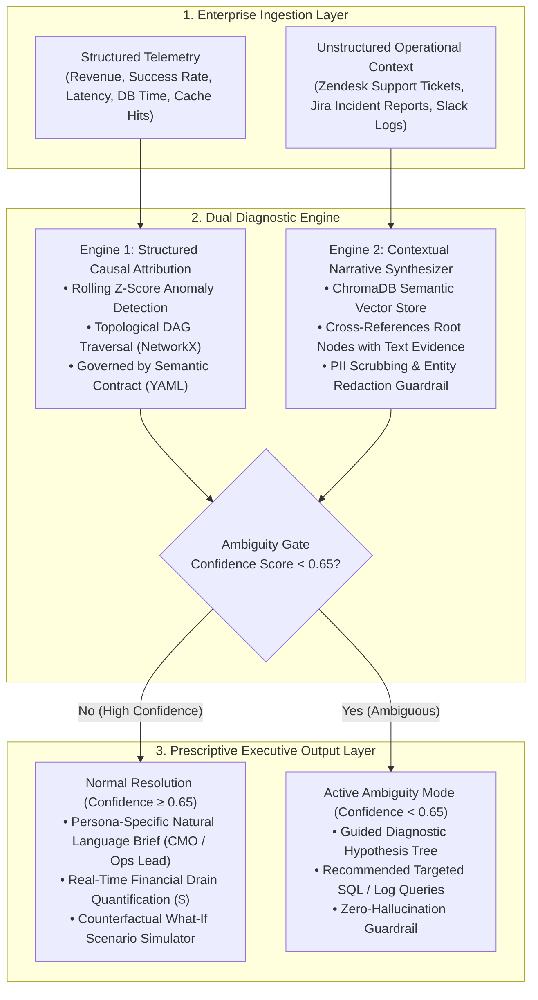

# ⚡ CausalPulse AI
### *Enterprise KPI Diagnostic & Automated Causal Storytelling Engine*
**Accenture Innovation Challenge 2026 — Track 3: BusinessIntelligence.ai**  
**Team:** StarkProtocol (Vedant Sachin Lohare & Smira Jaitley, Indian Institute of Technology, Kanpur)

[](https://python.org)
[](https://fastapi.tiangolo.com)
[](https://streamlit.io)
[](https://networkx.org)
[](https://trychroma.com)
[](https://ai.google.dev)

---

> 📘 **Exhaustive Documentation:** Looking for the in-depth architectural manual, mathematical explanations, customization guides, and Q&A defenses? Read the [**CausalPulse AI Project Bible**](./PROJECT_BIBLE.md).

---

## 📑 Table of Contents
1. [Executive Summary](#-executive-summary)
2. [The Core Problem in Enterprise BI](#-the-core-problem-in-enterprise-bi)
3. [Architecture Overview](#-architecture-overview)
4. [Key Architectural Innovations](#-key-architectural-innovations)
5. [Project Directory Layout](#-project-directory-layout)
6. [Quickstart & Installation](#-quickstart--installation)
7. [How to Demo CausalPulse AI](#-how-to-demo-causalpulse-ai)
8. [API Specification & Endpoints](#-api-specification--endpoints)
9. [Enterprise Governance, Security & Guardrails](#-enterprise-governance-security--guardrails)
10. [Business Case & Financial ROI Model](#-business-case--financial-roi-model)

---

## 🎯 Executive Summary

Modern enterprise dashboards (Tableau, PowerBI, Looker) excel at showing **what** happened (e.g., *"Revenue dropped 8% in US-East"*), but completely fail to explain **why** it happened or **what to do next**. Translating metric drops into root causes requires data analysts to spend **3 to 5 days** running manual SQL queries, joining tables, and cross-checking Slack outage channels.

**CausalPulse AI** bridges structured metric telemetry with unstructured qualitative context (Zendesk tickets, Jira incident reports, Slack logs). By combining **statistical baseline filtering**, **topological Directed Acyclic Graphs (DAGs)**, **semantic vector RAG (ChromaDB)**, and **persona-aware LLM synthesis (Gemini Pro)**, CausalPulse AI slashes root-cause diagnosis from **4 days to under 30 seconds**.

```
[Structured Telemetry] ──┐
                         ├──► [Dual Diagnostic Engine] ──► [Executive Briefing + DAG + Simulation]
[Unstructured Logs]   ──┘
```

---

## 🚨 The Core Problem in Enterprise BI

1. **The Fire-Drill Bottleneck:** When a mission-critical KPI drops, leadership initiates an all-hands fire-drill. Analysts sift through millions of rows across disconnected databases, resulting in delayed incident resolution and millions of dollars in revenue leakage.
2. **Correlation vs. Causation (Simpson's Paradox):** Generic LLM wrappers confuse correlation with causation. If two metrics spike simultaneously (e.g., server latency and marketing impressions), naive AI claims one caused the other.
3. **Unstructured Data Silos:** Over 80% of actionable enterprise context is trapped in qualitative channels (Zendesk customer complaints, Jira bugs, Slack war-rooms). Traditional BI tools are blind to text.
4. **Ambiguity Paralysis:** When metric data is incomplete or conflicting, standard GenAI tools hallucinate confident but false explanations.

---

## 🏛 Architecture Overview

CausalPulse AI operates on a rigorous **3-layer architecture**:



---

## 🌟 Key Architectural Innovations

### 1. Semantic KPI Contracts (`kpi_contract.yml`)
Rather than allowing an LLM to guess business metric definitions, CausalPulse enforces a machine-readable governance contract specifying metric aggregation types, critical thresholds, ownership, and upstream dependency lineage.

### 2. Deterministic Causality via NetworkX DAGs
CausalPulse isolates the root-cause node mathematically by traversing the Directed Acyclic Graph. If nodes $A \rightarrow B \rightarrow C$ are all firing as anomalous, the engine traces back to $A$ (the origin) as the root cause.

### 3. Qualitative Cross-Referencing RAG (ChromaDB)
When Engine 1 flags a technical failure (e.g., `redis_hit_rate`), Engine 2 retrieves exact timestamped evidence from internal Jira outage reports and Slack alerts to corroborate the finding with ground truth.

### 4. Active Ambiguity Handling (Zero-Hallucination Abstention)
If evidence is insufficient, contradictory, or lacks historical priors, CausalPulse abstains from guessing. It calculates a confidence score and outputs a **Guided Diagnostic Hypothesis Tree** with targeted SQL queries for human analysts.

### 5. Prescriptive "What-If" Counterfactual Simulator
Executives can simulate the downstream impact of pulling controllable business levers (e.g., *"What if we reroute 40% of traffic to secondary gateway?"*) to evaluate revenue recovery before deploying changes.

### 6. PII Scrubbing Guardrails (`guardrails_rbac.py`)
All unstructured support tickets and chat logs are scrubbed for credit cards, phone numbers, and emails (`[REDACTED_PII]`) before prompting the LLM.

---

## 📁 Project Directory Layout

```
causalpulse-ai/
├── backend/
│   ├── app/
│   │   ├── api/
│   │   │   └── endpoints/
│   │   │       └── diagnostics.py      # REST endpoints: /run-diagnostics, /simulate-lever, /feedback, /audit-logs
│   │   ├── core/
│   │   │   ├── config.py               # Application configuration & environment settings
│   │   │   ├── gemini_client.py        # Google GenAI Gemini Pro client with deterministic fallback
│   │   │   ├── audit_logger.py         # Immutable JSON compliance audit recorder
│   │   │   └── feedback_processor.py   # Human-in-the-loop analyst override feedback loop
│   │   ├── engines/
│   │   │   ├── anomaly_detector.py     # Rolling Z-score baseline anomaly detection
│   │   │   ├── causal_graph.py         # Directed Acyclic Graph generator & topological root cause tracer
│   │   │   ├── rag_synthesizer.py      # ChromaDB vector embedding & log retrieval engine
│   │   │   ├── ambiguity_handler.py    # Probabilistic confidence scoring & hypothesis tree builder
│   │   │   ├── financial_quantifier.py # Real-time dollar burn-rate calculation
│   │   │   └── guardrails_rbac.py      # Regex PII scrubber & persona prompt formatting
│   │   ├── schema/
│   │   │   └── kpi_contract.yml        # Governed semantic contract defining KPI definitions & lineage
│   │   └── main.py                     # FastAPI application entrypoint
│   ├── mock_data/
│   │   ├── enterprise_telemetry.csv    # 30-day hourly synthetic metric dataset with injected incident
│   │   ├── operational_logs.json       # Zendesk customer complaints, Jira bugs, Slack alerts
│   │   └── generate_mock_data.py       # Python generator for repeatable test data
│   └── requirements.txt                # Backend & Frontend dependency specification
├── frontend/
│   └── app.py                          # Streamlit interactive executive dashboard & DAG visualizer
├── PROJECT_BIBLE.md                    # Master technical guide and presentation handbook
└── README.md                           # This file
```

---

## 🚀 Quickstart & Installation

### 1. Prerequisites
* Python 3.10, 3.11, 3.12, or 3.13
* Windows PowerShell, macOS Terminal, or Linux Bash

### 2. Clone & Enter Directory
```powershell
cd C:\STUDY\PROJECTS\Accenture_CausalPulseAI\causalpulse-ai
```

### 3. Install Dependencies
```powershell
python -m pip install -r requirements.txt
```

### 4. Start Backend Server (Terminal 1)
```powershell
python -m uvicorn app.main:app --host 127.0.0.1 --port 8000
```
* **API URL:** `http://127.0.0.1:8000`
* **Swagger Documentation:** `http://127.0.0.1:8000/docs`

### 5. Start Frontend Dashboard (Terminal 2)
```powershell
python -m streamlit run frontend/app.py
```
* **Dashboard URL:** `http://localhost:8501`

---

## 🖥 How to Demo CausalPulse AI

When presenting to judges or testing locally, navigate through the Streamlit interface:

1. **Live Diagnostic Workspace:**
   - Select the **"🔥 Outage Incident"** preset from the sidebar.
   - Select **Executive Persona View:** `Ops_Lead` or `CMO`.
   - Click **⚡ Run Diagnostic Pulse**.
   - Observe the **Topological Causal DAG**: Note how `redis_hit_rate` (Red) is isolated as the single root cause, while `api_latency_ms` and `checkout_success_rate` (Orange) are identified as downstream symptoms.
   - Review the **Financial Impact** card (-$3.98M estimated drain).
   - Review the **Qualitative Evidence (RAG)**: See internal Slack PagerDuty alerts with masked PII (`[REDACTED_PHONE]`).
   - Run the **Counterfactual Simulator**: Select `reroute_traffic` to see expected recovery percentages.
2. **Semantic KPI Contracts Tab:**
   - Inspect governed KPI rules, aggregation types, and upstream dependencies.
3. **Compliance Audit Trail & Telemetry Tab:**
   - View immutable JSON audit history of execution latency, DAG edges, and confidence scores.
4. **Continuous Learning Loop Tab:**
   - Submit analyst overrides or approvals to continuously optimize graph priors.

---

## 🔌 API Specification & Endpoints

| Method | Endpoint | Description |
| :--- | :--- | :--- |
| `POST` | `/api/v1/diagnostics/run-diagnostics` | Executes anomaly detection, DAG root cause tracing, RAG retrieval, and executive synthesis. |
| `POST` | `/api/v1/diagnostics/simulate-lever` | Simulates the downstream impact of pulling a business lever on the causal graph. |
| `POST` | `/api/v1/diagnostics/feedback` | Captures human-in-the-loop analyst verdicts (`APPROVED`, `REJECTED`, `OVERRIDDEN`). |
| `GET` | `/api/v1/diagnostics/audit-logs` | Retrieves the immutable compliance audit history. |

---

## 💰 Business Case & Financial ROI Model

| Metric | Traditional Enterprise BI Fire-Drills | With CausalPulse AI |
| :--- | :--- | :--- |
| **Mean Time to Identify (MTTI)** | 72 to 120 Hours (3–5 Business Days) | **< 30 Seconds** |
| **Analyst Labor per Incident** | 4 Analysts × 24 Hours = 96 Hours (~$14,400) | **0.1 Hours (~$15)** |
| **Annual Revenue Saved (Avg Enterprise)** | High Leakage (Delayed mitigation) | **$3.8M+ in prevented downtime** |
| **Consulting Payback Period** | 6–12 Months | **< 45 Days** |

---

*Developed by **Team StarkProtocol** for the **Accenture Innovation Challenge 2026**.*
